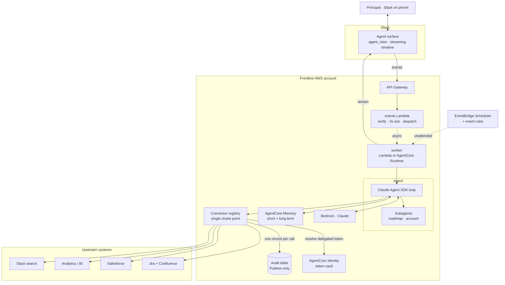

# Architecture

## Request path



## Why it is shaped this way

**The three-second rule shapes the left half.** Slack retries any event it does
not get a 2xx for within three seconds. With an unrestricted agent, a retried
turn can mean a duplicate Jira ticket or a second message to a customer. So the
edge function verifies the signature, drops retries, dispatches asynchronously,
and returns — it never does work. Everything expensive is downstream.

**Two entry points, one workload.** A human message and a schedule both land on
the same agent, the same connectors, and the same audit path. What differs is
authorization: interactive turns are unrestricted because someone is watching,
unattended turns are read-only because nobody is — enforced by filtering
`allowed_tools` before the loop starts, not by asking the model. His reply to an
unattended finding resumes the interactive path, so presence is the
authorization and there is no approval UI to build. See `triggers/base.py`.

**The registry is a choke point, not a convenience.** There is no code path from
the agent to an upstream system that bypasses `Registry.invoke`. That is what
makes "unrestricted, log everything" a position rather than an absence of one:
credential resolution and audit are structural, not something a connector author
has to remember.

**Two projections of one tool definition.** `as_sdk_tools()` for this agent,
`as_gateway_targets()` for AgentCore Gateway so other agents reach the same
capabilities over MCP. Requirement R5 is impossible if every agent reimplements
every connector.

**Worker placement is a swap, not a rewrite.** Lambda for short turns, AgentCore
Runtime for long ones — eight-hour sessions with per-session isolation versus
Lambda's fifteen-minute ceiling. `handler_worker.handler` is the entrypoint in
both cases.

## Repository map

```
src/frontline_agent/
  config.py             two modes, local and aws; everything branches here
  connectors/
    base.py             the contract — ToolSpec, Risk, DataClass  ← read first
    registry.py         choke point; SDK tools + Gateway targets
    _transport.py       HTTP, or fixtures in local mode
    atlassian.py        Jira + Confluence
    salesforce.py       accounts, cases (all REGULATED)
    analytics.py        product metrics (read-only by construction)
    slack_search.py     search-first retrieval; see ADR-005 on rate limits
    artifacts.py        canvases, file upload, deck rendering (R3.2)
  identity/token_vault.py   delegated OAuth; mock in local mode
  audit/log.py              the control (ADR-003)
  agent/
    core.py             the loop, subagents, event stream
    prompt.py           operating brief
    memory.py           short + long term
  slack/
    app.py              Bolt handlers — three events, no slash commands
    surface.py          streaming, status, suggested prompts, titles
    blocks.py           Block Kit
  triggers/
    base.py             autonomy policy — why unattended is read-only
    catalog.py          the standing triggers
  runtime/
    local.py            Socket Mode, for development
    handler_events.py   edge: verify, ack, dispatch
    handler_worker.py   the turn (human-initiated)
    handler_trigger.py  the turn (schedule-initiated, read-only)

infra/          CDK — audit stack (RETAIN) and agent stack
mocks/fixtures/ synthetic data; local mode never touches the network
manifest/       Slack app manifest
docs/decisions/ the five decisions that shaped all of the above
```

## Local vs AWS

One code path, two implementations behind three interfaces.

| | `local` | `aws` |
|---|---|---|
| Credentials | `MockTokenVault` | AgentCore Identity |
| Upstream | fixtures | live HTTP |
| Memory | JSON file | AgentCore Memory |
| Audit | JSONL | DynamoDB + S3 |
| Model | Bedrock if creds exist, else wiring tier | Bedrock |
| Slack | Socket Mode | API Gateway |

Local mode is not a stub. It exercises the registry, the vault interface, the
audit writer, and the agent loop — the same objects, with different backends. A
bug in the choke point shows up in `make demo`.
